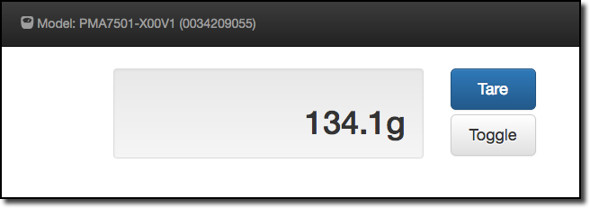
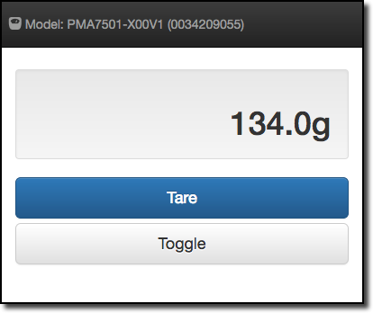

# sartorius-sbi-httpd
A simple Sartorius Scale web interface using the SBI protocol

# Description
This is an example application that shows how to use the 
[sartorius-sbi](https://github.com/ericlowry/sartorius-sbi)
module in an actual application. It uses 
[bootstrap](https://getbootstrap.com) 
for the UI and 
[socket.io](https://socket.io) 
for communication between the scale and the web application.

# Screen Shots

### Desktop View


### Mobile View


# Usage
```
$ node sbi-httpd.js --help

  Usage: sbi-httpd [options]

  Options:

    -h, --help              output usage information
    -V, --version           output the version number
    -d --ttyDevice <dev>    device name [/dev/tty.USB0]
    -b --baudRate <baud>    1200, [9600] or 38400
    --dataBits <bits>       7 or [8]
    --stopBits <bits>       0 or [1]
    --parity <parity>       odd, even or [none]
    --rtscts                ready-to-send, clear-to-send
    --xon                   xon handshake
    --xoff                  xoff handshake
    --xany                  xany handshake
    --responseTimeout <ms>  response timeout [200] milliseconds
    --precision <places>    weight precision [1] or 2 decimal places
```